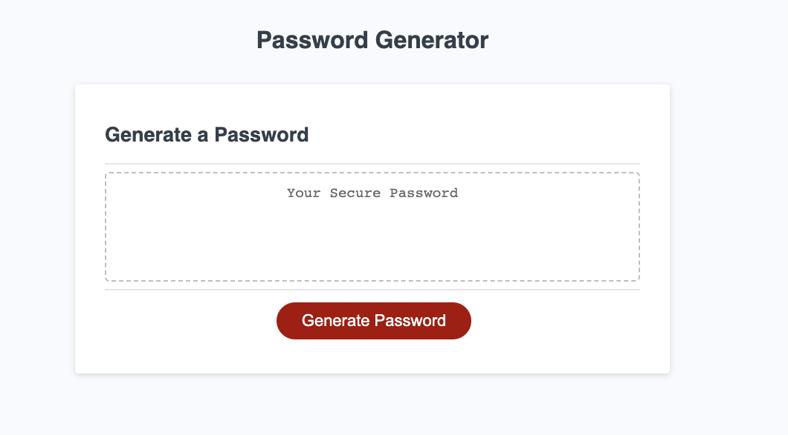
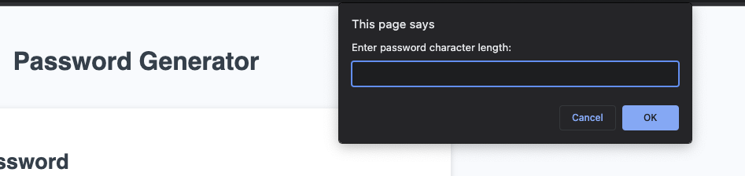
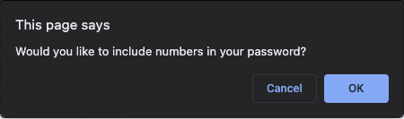
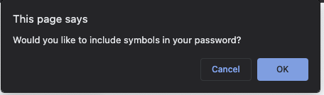
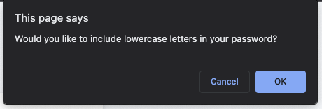
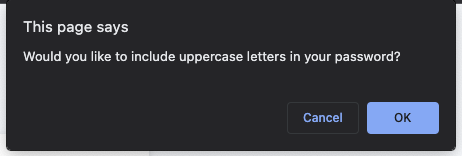
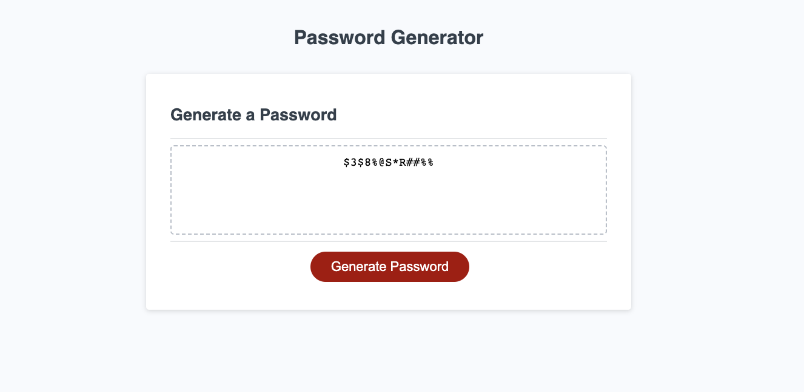

# week-2-challenge

## Description

I built this website to serve as a password generator for users.
A user is able to set the parameters of what to include into the password and the generator will follow these.
In building this website, I learned how to apply many different JavaScript concepts to come together to build a functioning password generator.

## Usage

Upon loading this website, the user will be shown a button that says "Generate Password."

When the user clicks on this button, a series of prompts will appear on the webpage that they will follow in order to generate a new password.

The first prompt that appears will ask the user to enter a password length.

After the user enters a valid password length, a series of questions will follow.

The questions will ask if the user would like to include numbers, symbols, capital letters and lowercase letters in their password.

When the user selects "okay" on the prompt, it will include that criteria into their password. If the user selects "cancel", the criteria will not be included in the password.

Finally, in the "Your Secure Password" box shown on the front of the webpage, the users new password that has been generated will now display.

